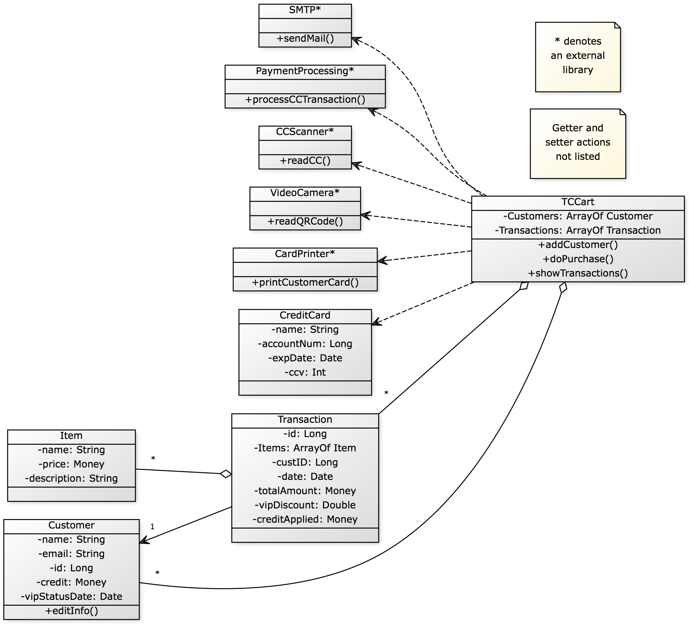

# TCCart Team Design Discussion

## 1. Pros and Cons of Individual Design

### Design 1 - pcassell3

#### Pros
 - The deign is short and sweet. The implementation would be much easier with a simple class definition and direct function calls.

 - The single TCCart class performs the tasks such as printCustomerCard() and sendMail().

#### Cons
 - The design is clear yet without a lot of details. 

 - The relationship is ambigous in UML class diagram. Dash line maybe represent dependence not association. 

### Design 2 - rharibabu3

#### Pros
 - The Item, Customer, Rewards, Purchase, and Transaction class each have a associated ID (i.e., ItemID, CustomerID, PurchaseID, and TransactionID) to identify itself. This provides a very convinient way to refer the instance. Moreover, the design is more prone to implement in database.

 - The design contains two types of manager, i.e., Utility Manager and Cart Manager to control utility function and maintain transaction information, respectively. Separate Utility Manager from Cart Manager improve the maintainability. 

#### Cons
 - This UML class diagram indeed has sufficient infomation for us to understand the design. However, it may be better to add details in relationship between classes (e.x. a relationship between transaction class and purchas class).  

 - The proposed relationship between classes may not be well defined from the class diagram. For example, Rewards can not exsit without belonging to Customer.

 - Customer (class) need to require Manager (class) to edit their own information. It would be more convient to let customer to update some of their information. 

### Design 3 - fwu35

#### Pros
 - The relationships between classes are well defined. The logic and functions of classes are very clear to understand/implement.

 - The classes are provided with all necessary atrributes and well-represented function relationship. The UML diagram help developers to clearly understand the design and how function calls.

#### Cons
 - Since the Manager class provides the function calls such as addCustomer and ProcessTransaction, it may be a convenient approach to store arrays of transactions also in this class.

 - The design can provide an Item class to provide descriptions of Item purchased, while storing such information separately in different class is also acceptable solution.

 - The classes (such as Customer and CustomerCard) maybe grouped together to reduce the number of classes. 

### Design 4 - rzhang360

#### Pros
 - The structure are the same as others and the design are clear. For example, a relationship between Store and Customer is well represented.

 - The class is grouped togther as much as it can be.

#### Cons
 - The function used external library is inside the class. The design lump many methods in the customer class, yet methods like printCard and sendEmail are called by the system, not the real customers.

 - Item needs more atrribute such as name, amount, etc.

## 2. Team Design

### Commonalities
 - The structure of class design are mostly same among our groups. This is very expected as the design is all about customer-purchase-item activites.

 - All of us use Manager class (i.e., TCCart in Design 1, Cart Manger in Design 2, Manager in Design 3, and Store in Design 4) to take control the most of tasks.

 - Most of us call the utility funciton outside the class.

 - Most of us represent item in a class, although not stated in project requirement document.

### Differences
 - We define and treat the relationship between classes differently. 

 - We treat reward differenty, either as single class or attributes in class.

 - How we calculate discount and credit is different. It is interesting to see how many way we can do to derive the correct discount applied to each purchase.

### Decision and Rationale
 - We decide to use Design 1 as template for our group design and UML class digram. It doesn't necessary mean the other's is not good. We want to be use one major design principle instead of hybrid so that we can be consistent in the future design. 

## 3. Summary
 - We learned how to discuss project questions in groups.
 
 - We team work to complete the task. 
  
 - We have learn how to perform design for the software development.

