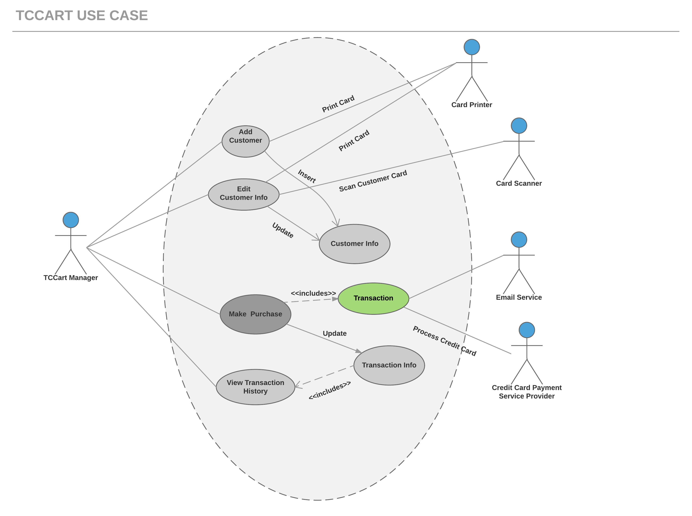
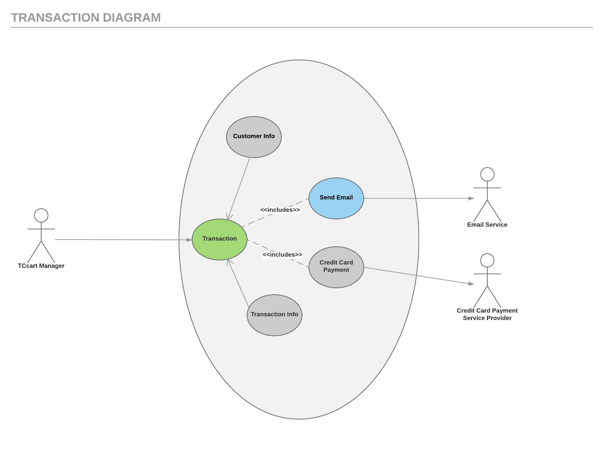

# Use Case Model

**Author**: 6300Spring16Team54 

| Version | Description     |
| --------|:---------------:|
| V1      | Initial version |
| V2      | Updated Sections 1 and 2 based on better understanding of the system |

## 1 Use Case Diagram

## 2 Use Case Descriptions

 'TCCart Manager' actor uses the app TCCart, to manage a Payment and Rewards System which sells Tea and Coffee. Top level use cases are Add Customer, Edit Customer, Make Purchase, and View Transaction History. Transaction use case could be used as a part of 'Make Purchase' use case. It allows the Customer to pay for the purchase he/she has made through Payment Processing system. The app allows the system to connect to various hardware devices such as Card Printer, Video Camera, Credit Card Scanner, enable the system to connect-to Payment Processing System and send email whenever necessary, for example sending mail to the Customer after every Purchase is made. 'Apply Discount& Rewards' use case is extended use case not available by itself as it's part of making purchase.

Except for the 'TCCart Manager' actor there are several other actors which will be described below with detailed use cases. 

**Hardware Devices( Card Printer, Card Scanner, and Email Service**

*Requirements:*

All the hardware devices attached to the system such as card printer, videocam, and credit card scanner can be accessed through existing external libraries. It enables the system to connect-to Payment Processing System and send emails.

  *Pre-conditions:*
 

 - New Customer should be added by 'TCCartManager',
 -  Customer Card should contain a QR Code, 
 - Customer should swipe Credit Card, 
 - Transaction must have been initiated

*Post-conditions*

- Unique id should be generated and Customer card should be printed using a special card printer as soon as a new Customer has been added by the 'TCCartManager'.
- customer card contains a QR code which should be read using a videocam attached to the system and encodes the customer’s unique ID.
- As soon as the Customer swipes the Credit Card it should be read by a Credit Card Scanner which ensures Authentication.
- The external libraries connected to the system should enable it to connect to the Payment Processing system once transaction has been initiated and send emails.

**Transaction**

*Requirements*

Once the Customer makes Purchase and swipes his Credit Card, the transaction has been initiated which allows the system to authenticate the credit card used by the Customer, Calculate Credit, apply Discounts & Rewards for the Purchase being made, enables Payment through Credit Card service provider and send email after every purchase.

  *Pre-conditions:*
- Customer should have swiped Credit Card for the transaction to be initiated

  *Post-conditions:*

- Credit Card Authentication is done after which Credit and Discounts are applied for the current purchase and enables the Customer to Pay through Credit card service provider and send email after the purchase is complete.

**Edit Customer Info**

This usecase let's the TC Cart Manager to edit Customer information whenever needed.

**View Transaction History**

*Requiremens*

This usecase let's the TC Cart Manager to keep track of all the Purchases made by the Customer and the Rewards applied for each purchase.

  *Pre-conditions:*

Customer must have made at least one Purchase.

  *Post-conditions:*

TC Cart Manage will be able to view the transaction history of the Customer.

